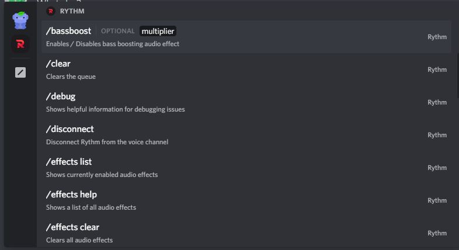

# Slash-Commands

**Slash Commands** is one of the new features introduced by Discord that help users to easily access commands from the chat box just by typing `/`

This Guide is looking forward to create a basic idea on this topic
